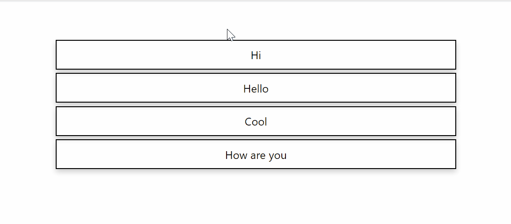
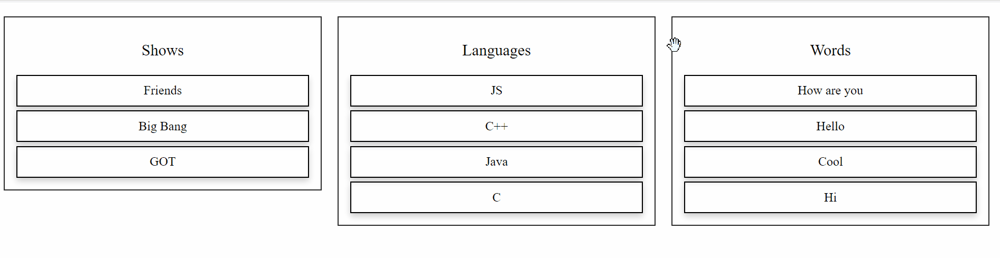

This is a simple React component that will enable you to reorder HTML elements. You can drag any component and change their position.

## Installation

Installation is done using the
[`npm install` command](https://docs.npmjs.com/getting-started/installing-npm-packages-locally):

```bash
$ npm install react-drag-reorder
```

## Example

Import `Draggable` from `react-drag-reorder` and wrap it between the components that you would like to drag and reorder.

```js
// ES6
import { Draggable } from "react-drag-reorder";
```

You would have to wrap the `Draggable` component to the components that you would like to reorder.

```js
import React, { Component } from "react";
import { Draggable } from "react-drag-reorder";

class Drag extends Component {
  state = {
    words: ["Hello", "Hi", "How are you", "Cool"],
  };
  render() {
    return (
      <div className="flex-container">
        <div className="row">
          <Draggable>
            {this.state.words.map((word, idx) => {
              return (
                <div key={idx} className="flex-item">
                  {word}
                </div>
              );
            })}
          </Draggable>
        </div>
      </div>
    );
  }
}

export default Drag;
```

## Getting the current position and new position of element

| Props       | Description                | type                           |
| ----------- | -------------------------- | ------------------------------ |
| onPosChange | subscribe to change events | function (currentPos , newPos) |

### Example

```js
import React, { Component } from "react";
import { Draggable } from "react-drag-reorder";

class Drag extends Component {
  state = {
    words: ["Hello", "Hi", "How are you", "Cool"],
  };

  getChangedPos = (currentPos, newPos) => {
    console.log(currentPos, newPos);
  };

  render() {
    return (
      <div className="flex-container">
        <div className="row">
          <Draggable onPosChange={this.getChangedPos}>
            {this.state.words.map((word, idx) => {
              return (
                <div key={idx} className="flex-item">
                  {word}
                </div>
              );
            })}
          </Draggable>
        </div>
      </div>
    );
  }
}

export default Drag;
```



## Updates

### 1.0

Support added to contain nested draggable components.

> Please make sure to sort the parent components first before reordering the child.

```js
class Test extends Component {
  state = {
    words: ["Hello", "Hi", "How are you", "Cool"],
    languages: ["C", "C++", "Java", "JS"],
    shows: ["GOT", "Friends", "Big Bang"],
  };
  render() {
    return (
      <Draggable>
        <div className="row">
          <p className="text">Words</p>
          <Draggable>
            {this.state.words.map((word, idx) => {
              return (
                <div key={idx} className="flex-item">
                  {word}
                </div>
              );
            })}
          </Draggable>
        </div>
        <div className="row">
          <p className="text">Languages</p>
          <Draggable>
            {this.state.languages.map((lng, idx) => {
              return (
                <div key={idx} className="flex-item">
                  {lng}
                </div>
              );
            })}
          </Draggable>
        </div>
        <div className="row">
          <p className="text">Shows</p>
          <Draggable>
            {this.state.shows.map((lng, idx) => {
              return (
                <div key={idx} className="flex-item">
                  {lng}
                </div>
              );
            })}
          </Draggable>
        </div>
      </Draggable>
    );
  }
}
```



Contributors are welcome ! :smiley:
